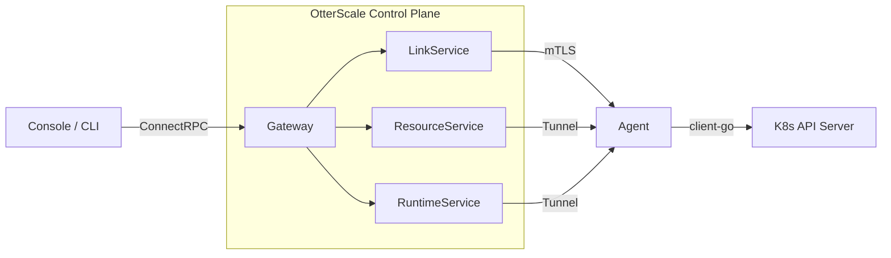

# OtterScale API

[](https://pkg.go.dev/github.com/otterscale/api)
[](https://www.npmjs.com/package/@otterscale/api)
[](https://github.com/otterscale/api/releases)
[](LICENSE)
[](https://buf.build)

[ConnectRPC](https://connectrpc.com) service definitions and generated Go stubs for multi-cluster Kubernetes management.

## Architecture



## 🚀 Quick Start

```bash
# Use as dependency
go get github.com/otterscale/api@latest

# Generate from proto (contributors only)
make generate
```

```go
import (
    linkv1 "github.com/otterscale/api/link/v1"
    resourcev1 "github.com/otterscale/api/resource/v1"
    runtimev1 "github.com/otterscale/api/runtime/v1"
)
```

## ⚙️ Services

| Service | Proto Package | Methods | Transport |
|---|---|---|---|
| **Link** | `otterscale.link.v1` | `ListLinks` · `Register` · `GetAgentManifest` | Unary |
| **Resource** | `otterscale.resource.v1` | `Discovery` · `Schema` · `List` · `Get` · `Describe` · `Create` · `Apply` · `Delete` · `Watch` | Unary + Server Stream |
| **Runtime** | `otterscale.runtime.v1` | `PodLog` · `ExecuteTTY` · `WriteTTY` · `ResizeTTY` · `PortForward` · `WritePortForward` · `Scale` · `Restart` | Unary + Server Stream |

## 🔑 Features

- **Link** — Agent registration and mTLS certificate provisioning
- **Resource** — Full CRUD + Watch for native resources and CRDs
- **Runtime** — Log streaming, interactive exec, port-forward, scale, rolling restart
- **OpenAPI** — Auto-generated `openapi.yaml` from proto definitions
- **Feature gating** — Per-RPC feature flags via custom `MethodOptions` extension
